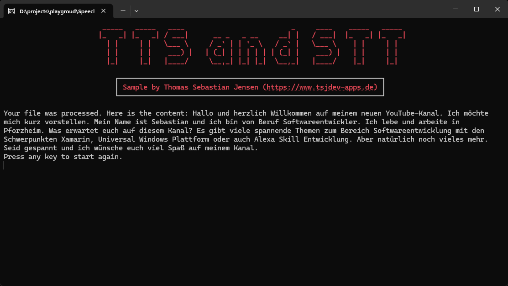

# Speech-To-Text and Text-To-Speech with (Azure) OpenAI

This repository contains a simple console application written in .NET 8 to demonstrate how to use Speech-To-Text (STT) and Text-To-Speech (TTS) of [OpenAI](https://openai.com) and/or [Azure OpenAI](https://azure.microsoft.com/en-us/products/ai-services/openai-service) using the [Azure.AI.OpenAI](https://www.nuget.org/packages/Azure.AI.OpenAI/) NuGet package.

## Usage

You need to create an OpenAI account on this [website](https://platform.openai.com/docs/overview). You have to pay to use the API so make sure that you add your payment information. After that, you can create an API Key [here](https://platform.openai.com/api-keys) for further use. If you have access to an Azure OpenAI instance you can also use this instance for the demo application.

Just run the app and follow the steps displayed on the screen.

## Screenshots

HEre you can se the console application in action.

First you need to select the host.

You need to enter the needed properties, like endpoints or API keys. Finally you can select the mode.

If you select `Speech-To-Text` you need to specify the path to an audio file. Finally you will get a transcription of the audio file.

If you select `Text-To-Speech` you need to provide a text.

You also need to select one of the six predefined voices.

Finally a MP3 file be generated and downloaded to your machine.

## Blog Posts / YouTube Video

If you are more interested into details, please see the following posts on [medium.com](https://www.medium.com) or in my [personal blog](https://www.tsjdev-apps.de):

- [Use OpenAI’s Text-To-Speech API to create audio files](https://medium.com/medialesson/use-openais-text-to-speech-api-to-create-audio-files-62e1f253206c)
- [Use OpenAI’s Speech-To-Text API to transcribe audio files](https://medium.com/medialesson/use-openais-speech-to-text-api-to-transcribe-audio-files-f66dd3d7d134)
- [Einrichtung von OpenAI](https://www.tsjdev-apps.de/einrichtung-von-openai/)
- [Einrichtung von Azure OpenAI](https://www.tsjdev-apps.de/einrichtung-von-azure-openai/)

You can also watch the following video on my [YouTube channel](https://www.youtube.com/@tsjdevapps):
- [Speech-To-Text und Text-To-Speech mit (Azure) OpenAI](https://www.youtube.com/watch?v=UQQKzL9f2gE)

## Buy Me A Coffee

I appreciate any form of support to keep my _Open Source_ activities going.

Whatever you decide, be it reading and sharing my blog posts, using my NuGet packages or buying me a coffee/book, thank you ❤️.

